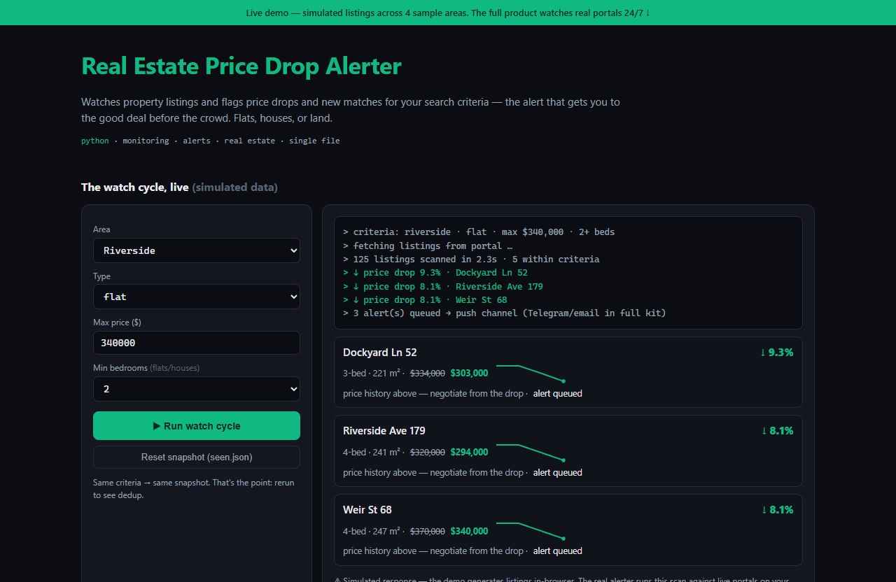

# Real Estate Price Drop Alerter — live demo

  

  <a href="https://amos-mig.github.io/real-estate-price-drop-alerter-demo/"><strong>▶ Open the live demo</strong></a> ·
  <a href="https://amosmign.gumroad.com/l/real-estate-price-drop-alerter"><strong>Get the full product · €29</strong></a>

## What this is

An in-browser simulation of the Real Estate Price Drop Alerter: you set search criteria (area, type, max price, beds) and run a watch cycle that flags price drops with per-property sparkline history plus new matches. A second run on the same criteria demonstrates the dedup snapshot suppressing repeat alerts — the full $29 Python product runs this scan against live portals on a schedule.

**Try it:** Run the watch cycle once to see drop/new-match alerts, then run it again unchanged to watch the dedup store suppress everything, then hit Reset snapshot to start over.

## What you get in the full product

- Watches listings by area, size, and price criteria
- Instant alerts on price drops and new matches
- Price history per property for negotiation leverage
- Deduplication so you only hear it once
- Single Python file — adapt selectors to your portal

## About

- **Storefront:** [kits.amosmignery.dev](https://kits.amosmignery.dev) — single-file products, instant download, commercial license
- **Checkout:** [Gumroad](https://amosmign.gumroad.com/l/real-estate-price-drop-alerter) (Merchant of Record, VAT handled)
- **Full product:** [Real Estate Price Drop Alerter](https://amosmign.gumroad.com/l/real-estate-price-drop-alerter) · €29

## License

The demo page in this repo is MIT-licensed — reuse the technique, not the product.
The **Real Estate Price Drop Alerter** itself is not included here and is not free software.
